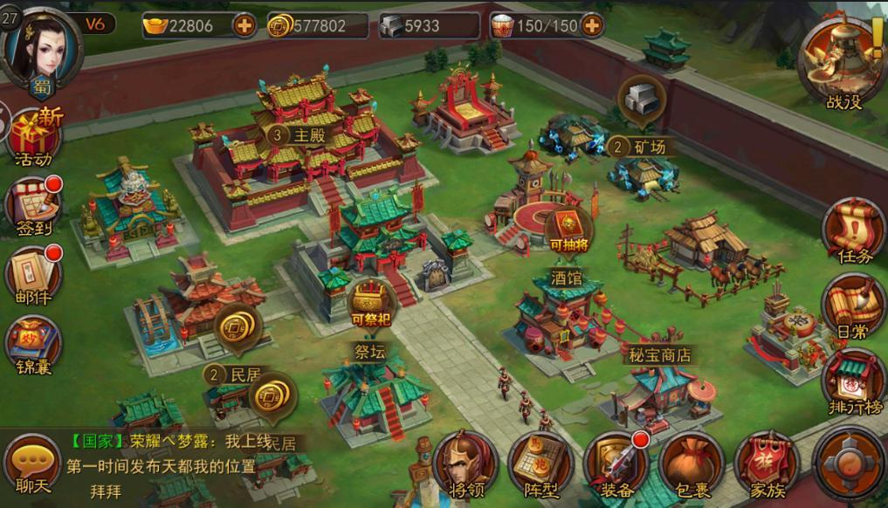

# About Me
My name is Sil Tian.  
I'm a current [M.S. in Computer Science (Game Development)](https://www.cs.usc.edu/masters/game-development) student at [USC](https://www.usc.edu/).  
I'm the Lead Designer and Gameplay Programmer of [AGP](http://gamepipe.usc.edu/files/b927ebd0746f70d8200a783ac0fb3cf5-51.php) [OrthoIso](#orthoiso).  

I worked as a Unity game developer at [X.D. Network Inc.](https://www.xd.com) for project [Heng Sao Qian Jun](#hsqj).  

I graduated as B.S. in Software Engineering from Shanghai Jiao Tong University.

I love ARPG, MMO, AR and Open World games.  
I also enjoy TCG, Puzzler, Visual Novel and Anime.  

Resume: [siltian.com/resume.pdf](https://silencious.github.io/resume.pdf)  
Linkedin Profile: [linkedin.com/in/sil](https://www.linkedin.com/in/sil/)  
Github Profile: [github.com/silencious](https://www.github.com/silencious)  
Email Address: [tjh0473@gmail.com](mailto://tjh0473@gmail.com)  

* * *  

# Projects  
## [OrthoIso](http://www.orthoiso.com) <small>(2018.01-Now)</small>
<iframe width="720" height="405" src="https://www.youtube.com/embed/SnO6lpmvx3k" frameborder="0" allowfullscreen></iframe>

Puzzle Platformer based on optical illusion.  
Inspired by Monument Valley, FEZ, Gorogoa and many other puzzle games.  
Role: Lead Designer, Gameplay Engineer  
Website: [orthoiso.com](http://www.orthoiso.com).

## [Catastropieces](https://sakuyal.itch.io/catastropieces) <small>(2017.09-2018.05)</small>
<iframe width="720" height="405" src="https://www.youtube.com/embed/caCR3LKdRbM" frameborder="0" allowfullscreen></iframe>

2.5D Rube Goldenberg machine Puzzle Game built in Unity3D.  
Role: Gameplay Engineer  
Release on [itch.io](https://sakuyal.itch.io/catastropieces).

## [Prime Engine Game](https://youtu.be/HI29vYOtwDk) <small>(2017.09-2018.05)</small>
<iframe width="720" height="405" src="https://www.youtube.com/embed/HI29vYOtwDk" frameborder="0" allowfullscreen></iframe>

FPS using Customized Game Engine in C++.  
I worked on 3D math of matrix transformation and shaders to implement  
Character Animation, AABB Collision, 3D Sound, Particle and UI.  
Role: Generalist Engineer  
Demos for two semesters: [Fall](https://www.youtube.com/watch?v=zO1Xay4gfqM) and [Spring](https://youtu.be/HI29vYOtwDk)

## [NPRShader](https://github.com/iiidiot/NPR_shader) <small>(2017.10-12)</small>  

<iframe width="720" height="405" src="https://www.youtube.com/embed/L-uNIusGE5Q" frameborder="0" allowfullscreen></iframe>

Anime looking NPR shader applied on 3D models.

## [Heng Sao Qian Jun](https://hs.xd.com)<small>(2016.07-2017.06)</small>  
  

Multiplayer online simulation mobile game.  
1,000,000+ Monthly Active Users

## [SoulSummoner](https://github.com/silencious/SoulSummoner) <small>(2016.03-06)</small>  

<iframe width="720" height="405" src="https://www.youtube.com/embed/CzDHDcZ0RRg" frameborder="0" allowfullscreen></iframe>  

As a Soul Summoner, take an adventure in the amazing world of elements, accumulate power from your surroundings, and summon servants to fight approaching enemies.  
Built with Unity3D and 3ds Max.  

## [ChemIt](https://www.youtube.com/embed/hXdAZWFeWOI) <small>(2016.03-06)</small>  
<iframe width="720" height="405" src="https://www.youtube.com/embed/hXdAZWFeWOI" frameborder="0" allowfullscreen></iframe>  

Do chemical experiments on your home computer, with your hands free from mouse and keyboard.  
Learn chemistry in the game, with fun and without danger.  
Built with Unity3D and Leap Motion.  

## [Quiddiards](https://github.com/silencious/Quiddiards) <small>(2015.09-12)</small>  
  

The combination of Billiards and Quidditch.  
Built with OpenGL and Qt.  

## [ZhiLiao](https://github.com/silencious/ZhiLiao) <small>(2015.06-09)</small>  
  

Messenger App on Android platform.  
Written in Java.  

## [LinkGame](https://github.com/silencious/LinkGame)  <small>(2014.07-08)</small>
  

Link the blocks to eliminate them in limited time and gain scores.  
Built with Qt.  
